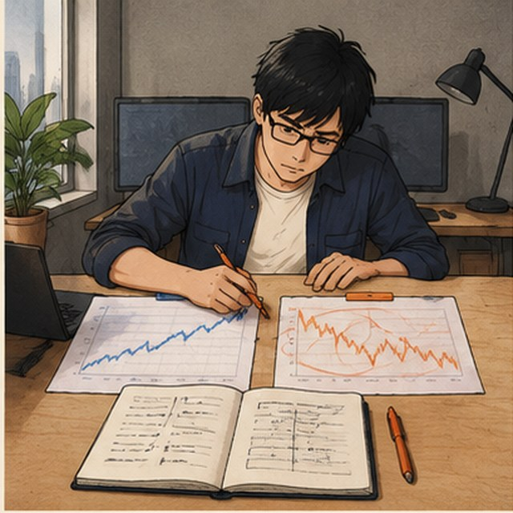

<p align="center">
  
</p>

<h1 align="center">WW</h1>

<p align="center">
  <strong>Quant Research · AI Systems · Backend / Full-Stack</strong><br />
  量化研究 · AI 系统 · 后端 / 全栈开发
</p>

<p align="center">
  <a href="mailto:212500581@qq.com">📧 212500581@qq.com</a>
  &nbsp;·&nbsp;
  <a href="https://github.com/WW-shan">GitHub</a>
</p>

<p align="center">
  
  
  
  
  
  
</p>

---

## 👋 About Me / 关于我

我喜欢把一个模糊的想法拆成**可以运行、可以检查、也可以继续迭代的东西**：先弄清楚问题和数据，再把实验做成代码，最后整理成别人能用的工具。

I like turning vague ideas into things that can be **run, checked, and improved**: understand the question and the data first, turn the experiment into code, then package it into something useful.

目前主要在做三类项目：

- **Research systems / 研究系统** — market data, validation, replay, backtests, reports
- **AI & backend tools / AI 与后端工具** — agents, APIs, workers, dashboards, automation
- **Small products / 小型产品** — study tools, bots, and practical web applications

🎯 **正在寻找量化、AI 或后端开发实习。**

**Currently looking for a Quant, AI, or Backend internship.**

---

## 🧭 How I Work / 我的做事方式

```text
Question → Data → Checks → Experiment → Review → Ship
问题    → 数据 → 校验  → 实验    → 复盘  → 上线
```

我更在意过程是否清楚、结果能否复现，以及失败时能不能知道问题出在哪里，而不只是展示一张漂亮的结果图。

I care about a clear process, reproducible results, and knowing why something failed—not just showing a pretty chart.

---

## 🎨 Stack / 技术栈

| Area | Tools | 方向 |
| --- | --- | --- |
| Core | Python · TypeScript / JavaScript · Go · Java | 后端、脚本、全栈项目 |
| Research | Market data · Backtesting · CatBoost · BC / PPO | 数据研究、策略实验、模型验证 |
| Backend | FastAPI · Workers · REST APIs · Telegram bots | API、后台任务、消息推送 |
| Frontend & Delivery | React · Vite · Docker Compose · GitHub Actions · GitHub Pages | 控制台、部署、CI |

---

## 🎞️ A Research Loop in 9 Frames / 九格研究小故事

> 这不是我的真实日常照片，而是把我做项目时常见的一条路径画成了一个小故事：发现问题 → 清理数据 → 质疑结果 → 做成工具 → 留下下一个问题。
>
> This is not a literal diary. It is a visual metaphor for a typical project loop: find a problem → clean the data → challenge the result → build a tool → find the next question.

<table>
  <tr>
    <td width="33%" align="center">
      <br />
      <sub><strong>01 · Discover / 发现</strong><br />两份图表对不上。</sub>
    </td>
    <td width="33%" align="center">
      <br />
      <sub><strong>02 · Trace / 追查</strong><br />先找到错位的位置。</sub>
    </td>
    <td width="33%" align="center">
      <br />
      <sub><strong>03 · Align / 对齐</strong><br />把时间和数据重新理顺。</sub>
    </td>
  </tr>
  <tr>
    <td align="center">
      <br />
      <sub><strong>04 · Clean / 清理</strong><br />让输入先变得可信。</sub>
    </td>
    <td align="center">
      <br />
      <sub><strong>05 · Stress-test / 质疑</strong><br />结果太漂亮，反而要小心。</sub>
    </td>
    <td align="center">
      <br />
      <sub><strong>06 · Rebuild / 重做</strong><br />把成本和现实条件放进来。</sub>
    </td>
  </tr>
  <tr>
    <td align="center">
      <br />
      <sub><strong>07 · Compare / 比较</strong><br />看清哪个结果值得继续。</sub>
    </td>
    <td align="center">
      <br />
      <sub><strong>08 · Build / 做成工具</strong><br />把研究变成能使用的界面。</sub>
    </td>
    <td align="center">
      <br />
      <sub><strong>09 · Iterate / 继续</strong><br />一个答案，通常会带来下一个问题。</sub>
    </td>
  </tr>
</table>

---

## ⭐ Selected Work / 精选项目

| Project | What it shows / 项目亮点 | Stack |
| --- | --- | --- |
| [**poly_strategy**](https://github.com/WW-shan/poly_strategy) | Prediction-market research pipeline: collection, relation discovery, replay, backtest and dry-run checks. / 预测市场研究链路：采集、关系发现、回放、回测和干跑验证。 | Python · Polymarket · Kalshi |
| [**Atlas20**](https://github.com/WW-shan/Atlas20) | Point-in-time rotation research with reproducible backtests, a FastAPI worker and a React/Vite console. / 可复现的轮动回测、FastAPI worker 和 React/Vite 控制台。 | Python · FastAPI · React · Docker |
| [**Crypto_Research_Agent**](https://github.com/WW-shan/Crypto_Research_Agent) | An autonomous research workflow with public data, validation, reports and paper-simulated experiments. / 用公开数据做验证、报告和纸面实验的研究 Agent。 | Python · Agents · SQLite |
| [**crypto-alpha-portfolio**](https://github.com/WW-shan/crypto-alpha-portfolio) | A structured way to test token-unlock, wallet, funding and anti-Sybil hypotheses before putting them into a portfolio. / 系统研究 token unlock、钱包行为、资金费率和反女巫假设。 | Python · Research · Backtesting |
| [**meme**](https://github.com/WW-shan/meme) | BSC token lifecycle data → dataset → hybrid model → bot, with explicit paper/live safety boundaries. / 从链上生命周期数据到数据集、混合模型和 bot，并明确区分 paper / live。 | Python · BSC · CatBoost · RL |
| [**LTT_Strategy**](https://github.com/WW-shan/LTT_Strategy) | A multi-timeframe signal monitor using Bitget/Yahoo data and Telegram alerts. / 多周期信号监控，连接 Bitget、Yahoo Finance 和 Telegram。 | Python · Telegram · APIs |

---

## 🗂️ More Projects / 更多项目

- [**ai-practice-study**](https://github.com/WW-shan/ai-practice-study) — Interactive AI revision site with 51 topics and 130 questions. / 51 个考点、130 道题的 AI 复习站。
- [**polyFIFA2026**](https://github.com/WW-shan/polyFIFA2026) — Football prediction research prototype. / 足球预测研究原型。
- [**ArenaFIFA2026**](https://github.com/WW-shan/ArenaFIFA2026) — Football data research project. / 足球赛事数据研究项目。
- [**fundingRate**](https://github.com/WW-shan/fundingRate) — Funding-rate arbitrage research. / 资金费率策略研究。
- [**second-hand-trading**](https://github.com/WW-shan/second-hand-trading) — Java full-stack second-hand marketplace project. / Java 全栈二手交易平台。
- [**KXO325**](https://github.com/WW-shan/KXO325) — Bilingual logistics study guide with a live demo. / 带在线演示的双语物流复习站。

---

## 📬 Contact / 联系我

如果你在招 **量化、AI 或后端开发实习**，欢迎直接发邮件：

If you are hiring for a **Quant, AI, or Backend internship**, email me directly:

<p align="center">
  <a href="mailto:212500581@qq.com"><strong>📧 212500581@qq.com</strong></a>
</p>

也欢迎通过 GitHub 联系我：

You can also reach me through [GitHub](https://github.com/WW-shan).

---

<p align="center">
  <sub>Thanks for stopping by. / 谢谢你看到这里。</sub>
</p>
