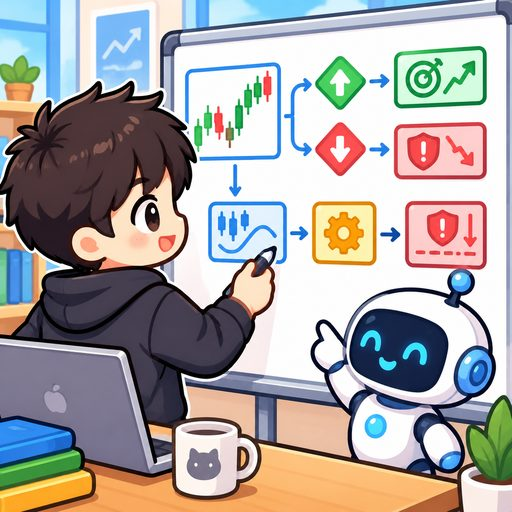

<p align="center">
  
</p>

<h2 align="center">Hi there 👋, I'm WW</h2>

<p align="center">
  <b>Quant Research · AI Engineering · Full-Stack</b>
  <br/>
  <sub>量化研究 · AI 工程 · 全栈开发</sub>
</p>

<p align="center">
  
  
  
  
  
</p>

---

## 🌟 About Me / 关于我

🎯 正在找 **量化 / AI / 后端开发** 实习 —— Looking for an internship in **Quant / AI / Backend**.

🔭 最近在折腾：**预测市场（Kalshi / Polymarket）研究、链上数据与量化信号、AI 工具链**。

🚀 我的风格很简单：**先把想法验证清楚，再认真落地**。每个项目都有自己的数据处理链路和回测/干跑验证，不搞空中楼阁。

> I like to verify ideas first and then build — every repo here has a clear data pipeline plus backtest / dry-run validation.

---

## 🎨 Tech Stack / 技术栈

```text
Python      ████████████████████████████ 80%   ★ 主力语言 / main language
TS/JS       ████████████████████████ 70%   ★ React / Node
Go          ██████████████████████ 60%    (网关与代理)
Java        ██████████████████ 45%        (全栈课设)
FastAPI     ██████████████████████████ 78%   ★ API 主力
React       ██████████████████████ 60%    (可视化控制台)
Docker      ████████████████████ 55%    (部署复用)
ML / RL     ██████████████████ 50%    (CatBoost / RL)
```

---

## 🎬 A Day in My Lab / 我的日常（九宫格小剧场）

> 这是用 **GPT-Image-2.5** 生成的一组小漫画，讲的是我（戴眼镜的小蓝）从起床到上线的普通一天，也是我 GitHub 项目的缩影。

<p align="center">
  
  
  
  
  
  
  
  
  
</p>

<p align="center">
  ☕ 起床 → 🚀 咖啡 → 🧠 策略 → 🔮 预测市场 → 🤖 AI 模型 → 📈 看收益 → 🚀 上线 → 🎧 摸鱼 → 🎉 又是充实的一天
</p>

---

## 📌 Featured Projects / 精选项目

### 🔮 poly_strategy — Prediction Market Research Toolkit / 预测市场研究工具
- 收集 → 回放 → **dry-run 验证** 一条龙，Kalshi / Polymarket 都在做
- Full pipeline: collection → replay → dry-run validation, with CI / tests / release.
- [👉 仓库](https://github.com/WW-shan/poly_strategy)

### 🐟 meme — FourMeme / BSC Token Lifecycle System
- 从收集 token 生命周期数据，到训练 **CatBoost 买点 + RL 卖点** 混合模型，再到 bot 运行。
- Collector → dataset → hybrid model → bot; paper & live trading ready.
- [👉 仓库](https://github.com/WW-shan/meme)

### 💎 crypto-alpha-portfolio — Crypto Alpha Research Portfolio
- 16-20 周结构化研究：**Token unlock / 鲸鱼镜像 / funding arb / anti-Sybil**，每个 edge 都过 Pass/Kill 关卡。
- Token unlock edge 已验证：**T-7→T0 平均 AR -8.2%（p=0.01）**。
- [👉 仓库](https://github.com/WW-shan/crypto-alpha-portfolio)

### 🌀 Atlas20 — Rotation Research + Web Console
- Python 轮动回测框架 + **FastAPI** 后端 + **React/Vite** 控制台，Docker Compose 一键部署。
- [👉 仓库](https://github.com/WW-shan/Atlas20)

### 🤖 LTT_Strategy — Telegram 量化信号机器人
- 海龟突破 / RSI 极值 / 多周期 K 线，Bitget + Yahoo Finance 双源，信号自动推送到 Telegram。
- [👉 仓库](https://github.com/WW-shan/LTT_Strategy)

### 🎓 ai-practice-study — AI 逐考点学习站
- 51 个考点 + 130 道题，把期末复习做成了可交互的站点。
- [👉 仓库](https://github.com/WW-shan/ai-practice-study)

---

## 🗂 More in my lab / 更多

| 项目 | 一句话 |
|------|--------|
| [Crypto_Research_Agent](https://github.com/WW-shan/Crypto_Research_Agent) | 上传数据直接跑研究的 Agent |
| [polyFIFA2026](https://github.com/WW-shan/polyFIFA2026) | 足球预测研究（TS） |
| [ArenaFIFA2026](https://github.com/WW-shan/ArenaFIFA2026) | 足球赛事数据（Python） |
| [fundingRate](https://github.com/WW-shan/fundingRate) | 资金费率差策略研究 |
| [novelCreating](https://github.com/WW-shan/novelCreating) | 小说创作工具原型 |
| [second-hand-trading](https://github.com/WW-shan/second-hand-trading) | Java 全栈二手交易平台 |

> 还有更多 → 直接 [逛仓库](https://github.com/WW-shan?tab=repositories) / More repos? [Browse](https://github.com/WW-shan?tab=repositories)

---

## 📬 Contact / 联系我

- 💬 **QQ：212500581**（备注 GitHub 就好）
- 🐙 GitHub: [WW-shan](https://github.com/WW-shan)
- 🚀 想一起做量化/AI 研究，或者有实习机会？随时找我聊！

> Wanna collaborate on quant/AI research or know an internship? Let's chat 👋

---

<p align="center">
  <sub>⚡ Designed with GPT-Image-2.5 & a lot of coffee — keep shipping. / 咖啡续命，代码不断更 ☕</sub>
</p>
